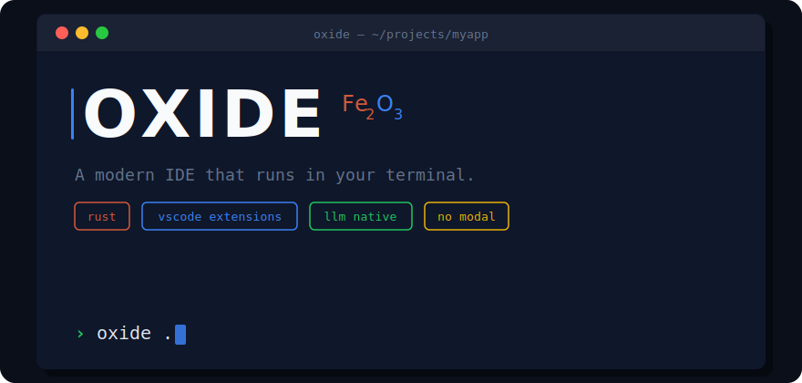
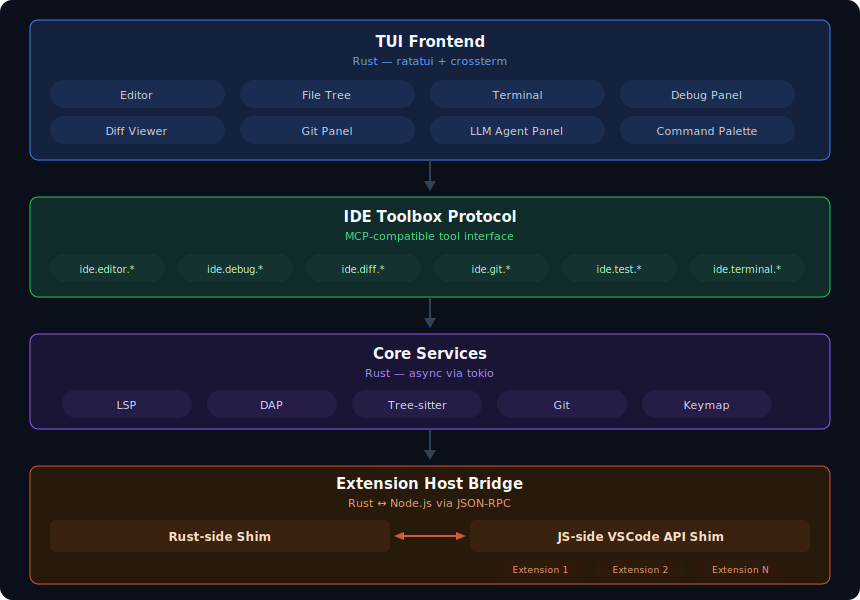

  

  <a href="https://oxideide.dev">Website</a> ·
  <a href="#architecture">Architecture</a> ·
  <a href="#roadmap">Roadmap</a> ·
  <a href="#contributing">Contributing</a>

  
  

---

Oxide is a terminal-native IDE built in Rust. It combines the speed and composability of the terminal with the UX of a modern editor — familiar keybindings, full mouse support, VSCode extension compatibility, and LLM agents as first-class participants in your development workflow.

No modal editing. No config files. It just works.

## Why

Developers are increasingly living in the terminal — SSH sessions, Claude Code, OpenCode, tmux workflows. But every terminal editor either demands you learn modal editing or forces you to assemble 50 plugins before you can be productive.

Meanwhile, LLM coding agents can read and write your files, but they can't set a breakpoint, inspect a variable, view a diff, or run your tests. They're powerful but blind to the IDE.

Oxide fixes both problems:

- **For developers:** A real IDE in the terminal with the keybindings you already know
- **For LLM agents:** Every IDE primitive (debugger, diff viewer, git, test runner) exposed as tools the agent can invoke

## Principles

**For the masses, not for terminal nerds.** Normal editing by default. `Ctrl+S` to save. `Ctrl+Z` to undo. Click to place your cursor. If you want Vim keybindings, they're available — but they're not the default.

**The LLM is a participant, not a sidebar.** Oxide exposes its internal primitives via the IDE Toolbox Protocol — a standardized, MCP-compatible interface that lets any LLM agent set breakpoints, inspect variables, stage git hunks, run tests, and observe results.

**Extensions are the ecosystem.** Oxide runs VSCode extensions via a compatible extension host. We don't rewrite language support for 50 languages — we run the extensions that already do it.

**Terminal is an implementation detail.** We say "IDE", not "terminal editor." The terminal is how we deliver speed and universal access. It's not the identity.

## Architecture

  

**Editor:** Custom-built in Rust. Tree-sitter for syntax highlighting, rope data structure for efficient editing, LSP for intellisense, DAP for debugging.

**Extension Host:** Separate Node.js process running a VSCode API compatibility shim. Extensions think they're running in VSCode. Communication via JSON-RPC over Unix domain sockets.

**IDE Toolbox Protocol:** Every IDE primitive exposed as a tool that any MCP-compatible LLM agent (Claude Code, OpenCode, Aider, etc.) can invoke.

## Default Keybindings

Oxide ships with familiar keybindings. No modes. No leader keys.

| Action | Keybinding |
|--------|-----------|
| Command Palette | `Ctrl+Shift+P` |
| Quick Open File | `Ctrl+P` |
| Save | `Ctrl+S` |
| Undo / Redo | `Ctrl+Z` / `Ctrl+Shift+Z` |
| Find in Project | `Ctrl+Shift+F` |
| Go to Definition | `F12` |
| Toggle Terminal | ``Ctrl+` `` |
| Start Debugging | `F5` |
| Multi-cursor | `Ctrl+D` |
| Open LLM Agent | `Ctrl+L` |

Optional keymaps: Vim, Helix, Emacs, Sublime, IntelliJ

## Roadmap

- [ ] **Phase 1 — Foundation:** Editor core, ratatui TUI shell, standard keybindings, mouse support, LSP, Tier 1 extension host, basic LLM agent pane
- [ ] **Phase 2 — IDE Power:** DAP debugging, diff viewer, git panel, test runner, IDE Toolbox Protocol v1, multi-cursor, integrated terminal
- [ ] **Phase 3 — LLM Deep Integration:** Agent-invocable debugger/diff/git/tests, inline suggestions, agent-agnostic protocol
- [ ] **Phase 4 — Enterprise:** Client/server architecture, multi-user sessions, SSO, audit logging, air-gapped deployment

## Tech Stack

| Component | Technology |
|-----------|-----------|
| Core | Rust |
| TUI | ratatui + crossterm |
| Syntax | tree-sitter |
| Text Buffer | ropey (rope) |
| Async | tokio |
| LSP | tower-lsp / lsp-types |
| Git | gitoxide |
| Extension Host | Node.js (separate process) |
| IPC | JSON-RPC over Unix domain sockets |
| LLM Protocol | MCP (Model Context Protocol) |

## Contributing

Oxide is in early development. We're building in the open and welcome contributors.

If you're interested in helping, start by reading the [founding document](./FOUNDING_DOC.md) for full context on the vision, architecture, and technical decisions.

Areas where help is most valuable right now:
- **Editor core** — text buffer, cursor management, selection, undo/redo
- **TUI layout** — ratatui-based windowing, panels, command palette
- **Tree-sitter integration** — syntax highlighting, code folding
- **VSCode API research** — mapping which API surfaces the top extensions use

Open an issue or discussion to say hello before diving in.

## License

Apache 2.0 — see [LICENSE](./LICENSE)

---

  <strong>Oxide</strong> is built by <a href="https://galvaniclabs.com">Galvanic Labs</a>

